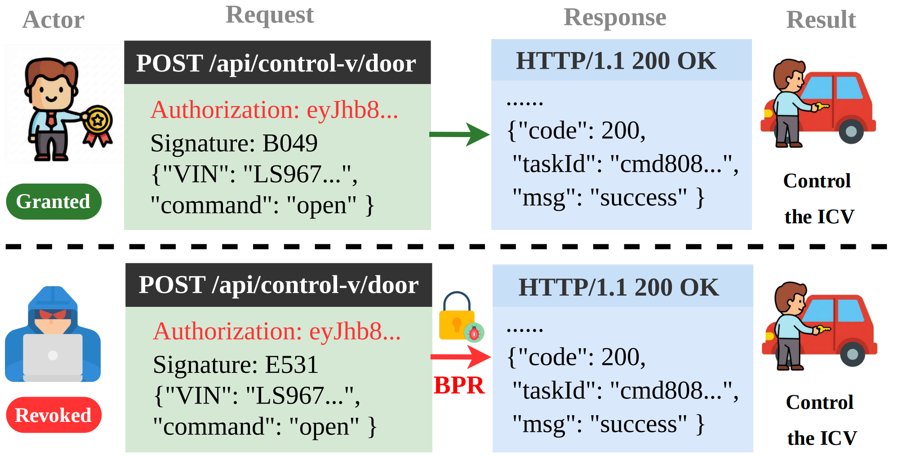
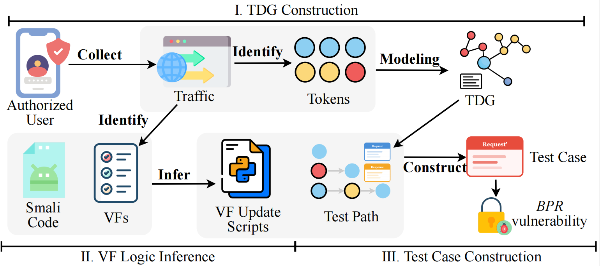

# Shadow Tokens: Uncovering the Broken Permission Revocation Vulnerability in Intelligent Connected Vehicles

<table>
  <tr>
    <td align="center" width="50%">
      <br/>
      <b>Threat Model</b>
    </td>
    <td align="center" width="50%">
      <br/>
      <b>Framework</b>
    </td>
  </tr>
</table>

## 📋 Overview
When a user revokes a permission, for example unbinding a vehicle, the ICV cloud platform should invalidate the related token immediately. This stops the token from accessing protected resources. If a permission has been revoked but the server still accepts the original token, this creates a **Broken Permission Revocation (BPR)** vulnerability. BPRHunter is designed to detect this type of vulnerability.


---

## 🔗 Architecture

BPRHunter runs as a three-stage pipeline. Each stage reads its inputs from disk, writes its outputs to disk, and hands off to the next stage.

| Stage | Input | Output |
|---|---|---|
| TDG Construction | HAR traffic | `auth_tokens.csv`, `refresh_tokens.csv`, `exchange_tokens.csv`, `tdg.json` |
| VF Logic Inference | HAR traffic, smali bytecode | `output/vfs/<domain>/update_vf.py`, `_verification.json`, `_chat_histories.json` |
| BPR Detection | `tdg.json`, HAR traffic, VF scripts | `output/testcases/<token>.json`, `output/results/<token>.json` |

---

## 📁 Input

`input/traffic/`: Captured HTTP traffic in HAR format.

`input/smali/`: Decompiled Smali code used to infer dynamic verification-field generation logic.

## 📁 Output

`output/tdg/`: Identified tokens and the generated Token Dependency Graph.

`output/vfs/`: Inferred, generated, and verified dynamic verification-field updater scripts, grouped by domain.

`output/testcases/`: Generated test cases and request-execution logs.

`output/results/`: Final response-comparison and BPR vulnerability-detection results.

---

## 🚀 Quick Start

### ✅ Prerequisites

- Python 3.8+
- API key

### 📦 Install

```bash
pip install -r requirements.txt
```

### ⚙️ Configure

Set your API key through the environment, then review `config.py`.
Recently, we found that DeepSeek appears to offer better cost-effectiveness, so it can be used as the base model.

```bash
export BPRHUNTER_API_KEY="your-api-key"
```

```python
HAR_FILE      = "input/traffic/demo.har"   # path to your HAR capture
SMALI_DIR     = "input/smali/targetapp"    # root of smali package tree
API_BASE_URL  = "https://api.deepseek.com"
MODEL         = "deepseek-xxx"          # inference (reasoning)
CODEGEN_MODEL = "deepseek-xxx"          # code generation (stable)
DEMO_MODE     = True                    # mock HTTP — no real network calls
```

### ▶️ Run

```bash
# All three stages
python main.py

# Specific stages
python main.py --stages 1 2   # TDG + VF inference
python main.py --stages 3     # BPR detection (needs prior Stage 1 & 2 output)
```
---

## ⚠️ Demo

The demo HAR traffic and Smali bytecode are intended to be anonymized:

- 🌐 All hostnames use the placeholder `apigateway.target-platform.example.com`.
- 📦 All Java package names use the placeholder `com.example.*`.
- 🔑 All credentials use the placeholder values `PLACEHOLDER_ACCESS` / `PLACEHOLDER_SECRET`.

The demo data exists solely to illustrate the pipeline. Since we are no longer authorized to test against the real target, Stage 3 runs in demo mode (`DEMO_MODE = True`): HTTP requests are intercepted and the original HAR response is returned for every request. To run against a real target, set `DEMO_MODE = False`, provide real inputs, and point `config.py` at genuine traffic and smali.
